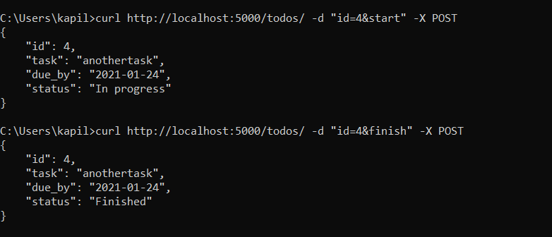

# Running the code
- run `create_db.py` to create a database with three entries
- create localhost server by running `task1.py`

# Using the api
1. Viewing all the tasks

2. Creating task

3. Changing status of tasks

4. Finding tasks due on given date

5. Tasks overdue today (2021-01-23)

6. Finished tasks

